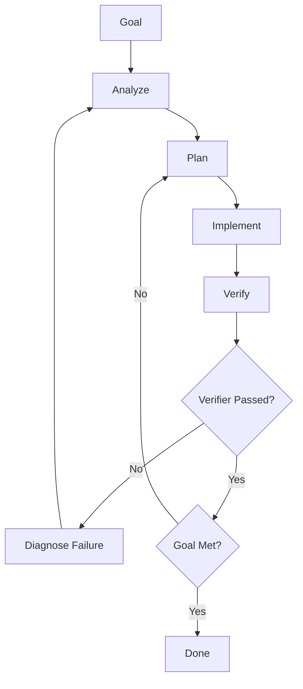

# Loop Catalog

## Universal Loop

## Feature Loop

Goal → user story → acceptance criteria → design → implement → tests → docs → CI → done.

Verifier: acceptance criteria pass, tests pass, no regression.

## Bug Fix Loop

Bug report → reproduce → failing test → root cause → minimal fix → regression tests → done.

Rule: do not patch symptoms when root cause can be found.

## Refactoring Loop

Baseline → characterization tests → small refactor → verify → repeat → done.

Rule: no behavior change unless explicitly requested.

## CI/CD Repair Loop

CI failure → logs → classify failure → root cause → minimal patch → verify locally → PR → done.

Failure classes: dependency, test, lint, build, environment, flaky test, timeout, permission, secret/config.

## Infrastructure Loop

Goal → validate → plan → policy review → approval if risky → apply to dev/test → smoke test → promote.

Rule: no destructive infrastructure changes without approval.

## Security Loop

Threat → control → test → abuse case → fix → verify → document residual risk.

## Performance Loop

Measure → bottleneck → hypothesis → change → benchmark → compare → keep or rollback.

Rule: do not optimize without measurement.
