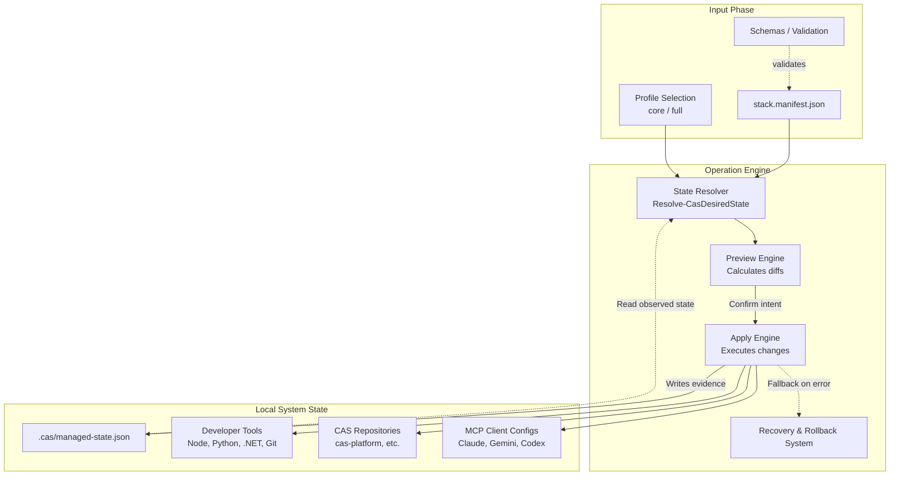

# CAS Workstation Architecture

This document describes the architectural flow, state management, and design constraints of the **CAS Workstation** bootstrap bundle. 

The primary responsibility of CAS Workstation is to take a declarative definition (`stack.manifest.json`) and synchronize it onto a host Windows workstation without conflicting with the user's personal configuration.

## System Design

CAS Workstation adopts an idempotent, declarative architecture. All mutations to the system (installing tools, cloning repositories, modifying settings) pass through an **Operation Engine** that calculates desired state before applying changes.

### Core Workflow

The typical execution path follows three steps: **Plan**, **Apply**, and **Record**.

1. **Plan:** The engine reads `stack.manifest.json`, validates it, and merges the requested profile (e.g., `core`, `full`) to generate a Desired State map. The current state is observed without mutating the system.
2. **Apply:** Mutations are executed. External installers (e.g., winget, scoop, npm) run, repositories clone or sync, and MCP client configurations are injected.
3. **Record:** All owned artifacts and their states are logged into an explicit ledger (`managed-state.json`) inside the CAS config root. 

### Architecture Diagram

## State Management

CAS Workstation is designed for safety and clean uninstalling. It enforces strict ownership rules:
- **Created**: The resource was created by CAS. It can be safely deleted.
- **Modified**: The resource was modified by CAS. Original backups must be restored on uninstall.
- **Observed**: The resource was pre-existing (e.g., user already had Docker installed). CAS will leave it untouched during uninstall.

State boundaries are strictly enforced. Mutation and removal targets must remain within approved CAS roots; operations that attempt to write to arbitrary drives, user profiles, or reparse-point paths fail closed.

## Component Configuration (MCP Clients)

A critical function of the workstation is injecting AI skill configuration (like `prompt-refiner`) into client CLIs (Codex, Claude Code, Gemini CLI). CAS uses targeted adapters (e.g., `json-mcp`) to parse a tool's JSON configuration and safely inject specific namespaces.

- Modifies only the namespaced `cas-workstation.*` properties.
- Atomically backs up original files before making changes.
- Records an owned-content digest to identify drift.

## Security and Authentication

- **No Embedded Secrets:** The CAS ecosystem relies completely on user-controlled authentication or Azure Managed Identity. Authentication payloads, tokens, and API keys are never generated, captured, or injected by the workstation manifest.
- **Closed Operations:** Invalid or unauthorized state changes automatically fail closed. Any unallowlisted installation tools or identity types halt execution.
