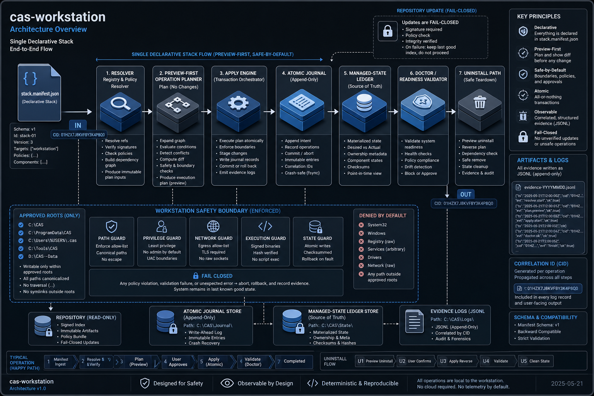
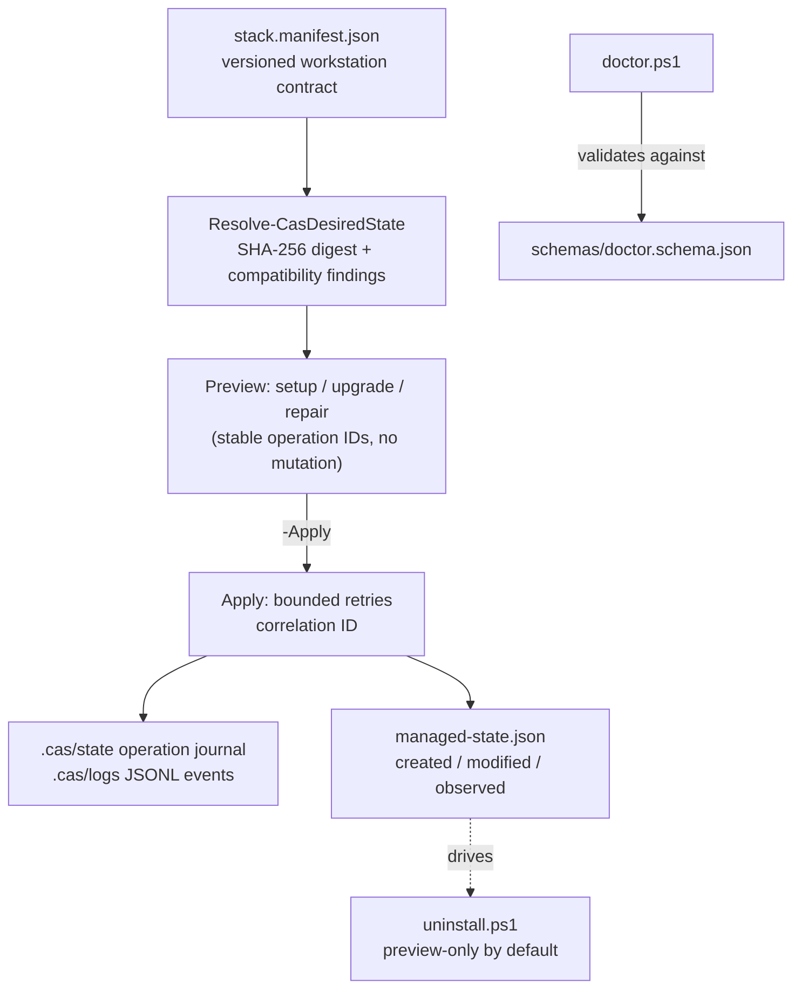

# Architecture

`cas-workstation` resolves a single declarative contract (`stack.manifest.json`) into a
normalized desired state, then executes mutations through a preview-first, fail-closed operation
engine with an atomic journal.

<!-- codex:generate-image prompt="A workstation control panel with a single glowing contract document feeding a resolver gear, which drives a preview screen showing planned changes before a green apply button, with a ledger book recording every action and a padlocked scope boundary around the whole machine; isometric, enterprise blue/graphite palette" style="isometric, enterprise, clean" replaces="mermaid-above" -->

## Safety and managed state

Resources are classified as `created`, `modified`, or `observed` in `managed-state.json`;
pre-existing resources cannot be claimed as CAS-created. Mutation and removal targets must stay
within approved CAS roots — drive, profile, system, escaping, and reparse-point paths are
rejected. Writes use validated sibling temporary files and backup evidence.

## Preview-first apply engine

Setup, upgrade, and repair are preview-first entry points over the same deterministic operation
engine. Preview shows stable operation IDs, changes, skips, commands, sources, and risks without
mutating the workstation. Mutation requires explicit `-Apply` intent; every apply gets a
correlation ID and writes an atomic operation journal under `.cas\state` plus JSONL events under
`.cas\logs`. Retries are bounded; a failed operation stops later work and records actionable
resume guidance. Repository updates fail closed when a checkout is dirty, detached, on an
unexpected branch, has local commits, uses an unexpected origin, or cannot prove a fast-forward
relationship.

## Readiness reporting (`doctor.ps1`)

`doctor.ps1` produces a machine-readable readiness report validated against
[`schemas/doctor.schema.json`](../../schemas/doctor.schema.json) — the workstation-level health
sweep for this repo's own scope (tooling, AI CLIs, CAS component repos, MCP configuration).
This is distinct from the root PersonalRepo workspace's own `scripts/workspace-health.ps1`
control-plane sweep (Phase 34), which audits the wider multi-repo workspace, not this
bootstrap-bundle repo specifically.

## Client, skill, and workspace profiles

Client adapters manage only the namespaced `cas-workstation.prompt-refiner` MCP entry, preserve
unrelated settings, atomically back up modified files, and record an owned-content digest for
drift repair. Skills and workspaces are copied only from manifest-allowlisted repositories into
approved CAS-managed boundaries; existing unowned targets, unsafe relative paths, reparse
points, malformed client files, and conflicting owned namespaces fail closed.

<!-- docs-verified: 4c70f86190c6cd2333fb6357a5928fbb904776ef 2026-07-08 -->
